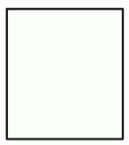
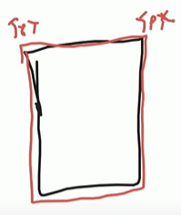
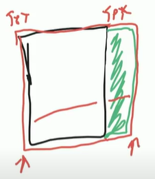
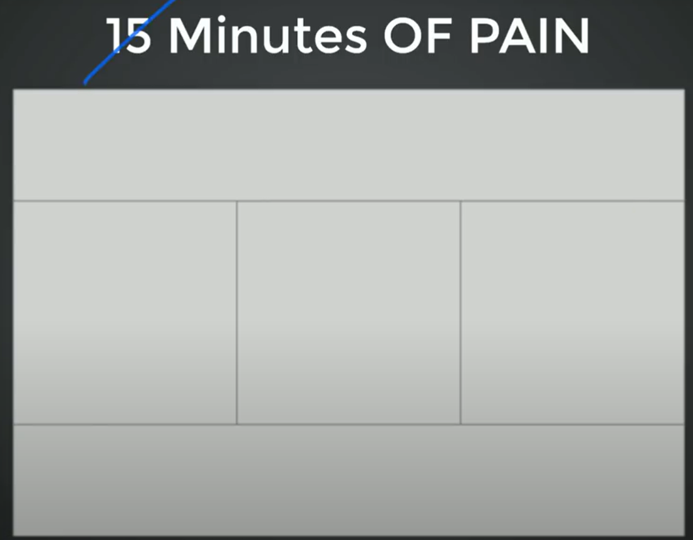

# Lesson 05: Learn CSS Layout 🚀

## **What You'll Learn**
- Understanding the **Box Model** and how elements take up space.
- Introduction to **CSS Layouts** using floats.
- Hands-on **Practice with Layouts**.
- Homework: Create **three simple layouts** using what you've learned.

---

## 📦 **Box Model**

### What is the Box Model?
- In HTML, every element is a **box**.
- The **Box Model** explains how elements occupy space and interact with other elements on a webpage.
- Each box consists of **four key parts**:
  - **Content**: The actual text or image inside the element.
  - **Padding**: Space between the content and the border.
  - **Border**: The outline surrounding the padding.
  - **Margin**: Space outside the border, separating elements.

Example: A section with a `100px` width and `100px` height.



### Box Model Breakdown
1. **Adding a 5px border** (red):
   - Width = `100px + (5px * 2) = 110px`
   - Height = `100px + (5px * 2) = 110px`

   

2. **Adding 20px right padding** (green):
   - Width = `100px + (5px * 2) + 20px = 130px`
   - Height remains `110px`

   

3. **Layout Calculation Example**
   - If we have a container of `300px` width:
     ```
     300px / 130px ≈ 2
     ```
   - Only **2 elements** will fit in a row, and the third will move to the next line.

---

## 🎨 **CSS Layouts: Float**

### Introduction to Float
- Before **Flexbox** and **CSS Grid**, layouts were made using `float`.
- Although outdated, `float` is still used in some cases.
- Floating elements **push** themselves as far left or right as possible.
- **Float-based layouts** require specifying widths using percentages.

### Example: Simple Layout Using Float
We will create a layout with a **header, footer, and three sections**.

#### **HTML Structure**
```html
<body>
  <header>Header</header>
  <section>Section 1</section>
  <section>Section 2</section>
  <section>Section 3</section>
  <footer>Footer</footer>
</body>
```

#### **CSS Styling**
```css
header, footer {
  background-color: #333;
  color: white;
  text-align: center;
  clear: both;
  padding: 10px;
}

section {
  float: left;
  width: 33%;
  height: 300px;
  background-color: #f4f4f4;
  border: 1px solid #ccc;
  text-align: center;
  line-height: 300px; /* Centering content */
}
```



### Issues and Fixes
- The **footer does not stay at the bottom** because floated elements are removed from normal document flow.
- **Fix:** Use `clear: both;` on the footer to prevent it from floating up.

### Understanding Width Calculation
- Why use `33%` instead of `33.3333%`?
  - The **border** adds extra pixels, causing the layout to exceed `100%`.
  - Solution: Use `box-sizing: border-box;` to include the border inside width calculations.

#### **Global Fix for Box Model Issues**
```css
* {
  box-sizing: border-box;
}
```

---

## 🏆 **Homework: Create 3 Simple Layouts**
1. **A blog post layout** with a header, sidebar, and main content.
2. **A portfolio grid** with multiple image sections.
3. **A card-based UI** similar to a product listing page.

---

## ✅ **Key Takeaways**
- The **Box Model** determines how elements take up space.
- `float` can create **multi-column layouts**, but Flexbox and Grid are preferred today.
- `box-sizing: border-box;` ensures accurate width calculations.
- `clear: both;` prevents floating issues.

## 🏠 **Homework**
✅ **Code 3 Simple Layouts** – No Grid or Flexbox, only float.
✅ **1st Layout:** 
✅ **2nd Layout:** 
✅ **3rd Layout:** 
✅ **Read Shay Hower** – [Responsive Design](https://learn.shayhowe.com/advanced-html-css/responsive-web-design/)  

---

Happy Coding! 🚀
