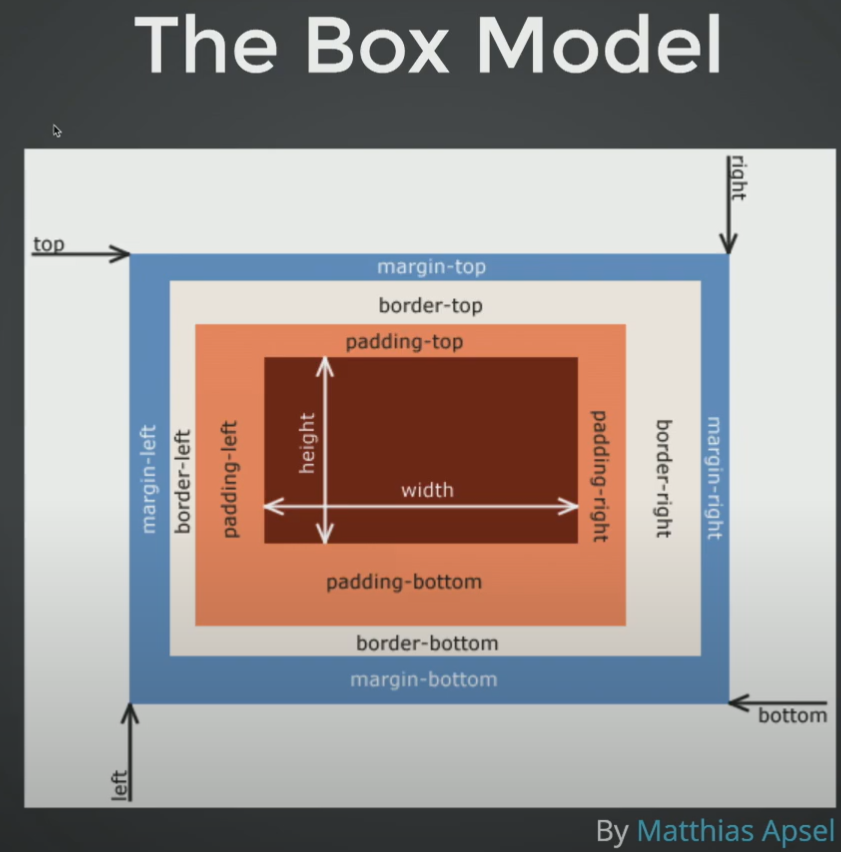
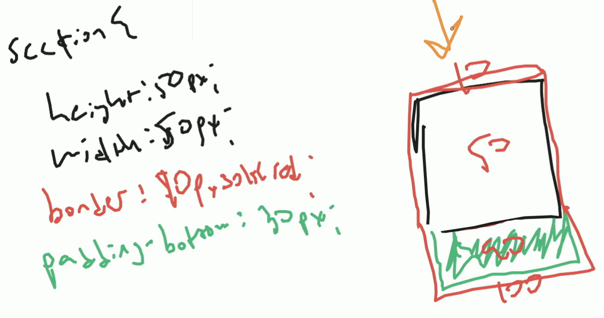

# Lesson 06: Review HTML & CSS 🚀

## **What You'll Learn**
- Review - HTML Fundamentals
- Review - CSS Fundamentals
- Review - Box Model
- Review - Float 😱
- Review - Three Simple Layouts
- Learn - Responsive Basics
- Homework: Simple Responsive Site

---

## 📚 **Review - HTML Fundamentals**
- The Golden Rule - Separation of Concerns
- HTML = Content, CSS = Style, JS = Behavior
- HTML Syntax
```html
<p class="intro">Hello, World!</p>
```
- <p> is opening tag, </p> is closing tag, class is an attribute, "intro" is its value.
- Time for some tags
- Headings: h1, h2, h3, h4, h5, h6 (h1 being most important)
- p: paragraph, span: short inline text, pre: preformatted text
- Containing tags: div, section, article, aside, header, footer, nav
- Markup BBC News homepage


## 🎨 **Review - CSS Fundamentals**
- Where does CSS go?
- Inline, Internal, External (Separate File)
- Inline Style give 1000 points specificity, and that's a lot if we want to override it.
- Use a separate file for CSS in head section of HTML.
```html
<link rel="stylesheet" href="styles.css">
```
- CSS Syntax
```css
p {
  color: red;
  font-weight: bold;
}
```
- 'red' is a value, 'color' is a property, 'color: red;' is a declaration.
- p {} is a rule, and everything inside {} is a declaration block.
- Why we want to link to a separate file?
- Separation of Concerns, Reusability, Maintainability
- Simple Styles:
- Color: Words (yellow), Hex (#ff0), RGBA (rgb(255, 255, 0, 1)), HSLA (hsl(60, 100%, 50%, 1))
- Fonts: font-family (Arial, sans-serif), font-size (16px), font-weight (bold)
- Use MDN for CSS Reference (https://developer.mozilla.org/en-US/docs/Web/CSS)
- Also, read https://learn.shayhowe.com/advanced-html-css/ for more details.
- Code along with CSS (Some Basic CSS in follow along materials) - basic-css-two

## 📦 **Review - CSS Relationships**
- parent > child (direct child)
```html
<section>
  <p>Hello, World</p>
</section>
```
```css
section > p {
  color: red;
}
```

- parent child (any level)
```html
<section>
  <article>
    <p>Hello, World</p>
  </article>
</section>
```
```css
section p {
  color: red;
}
```

- sibling + sibling (adjacent sibling)
```html
<section>
  <p>Hello, Twitch</p>
  <p>Hello, YouTube</p>
</section>
```
```css
p + p {
  color: red;
}
```

- Lets do some exercises on CSS Relationships (Follow along materials) - relationship-css-two

### 📦 **Review - IDs and Classes**
- IDs are unique identifiers, and we can use them only once in a page.
```html
<section>
  <p>Hello, Twitch</p>
  <p id="zebra">Hello, YouTube</p>
</section>
```
```css
#zebra {
  color: red;
}
```

- Classes are reusable, and we can use them multiple times in a page.
```html
<section>
  <p class="robot">Hello, Twitch</p>
  <p id="zebra" class="bob">Hello, YouTube</p>
  <p class="bob">Goodbye, Mixer</p>
</section>
```
```css
.bob {
  color: red;
}
```

- Specificity - Inline > ID > Class > Element
- Points System - Inline = 1000, ID = 100, Class = 10, Element = 1
- Three Questions on Specificity points is in video of leon (https://www.youtube.com/watch?v=L55ax0blZY0&t=4301s)
- Lets code along with IDs and Classes (Follow along materials) - specificity-practice

### 📦 **Review - Box Model**

- EVerything is html is a box, and it has content, padding, border, and margin.
- Example of Box Model

- Box Sizing: content-box (default), border-box (content + padding + border)
```css
* {
  box-sizing: border-box;
}
```
- Lets Draw Box Model (Follow along materials) - box-model-practice

- Lets Look at a Starter Template (Follow along materials) - template
- Leon has made it easy for us to start with a template, and we can use it to start our projects.
- In the HTML file we have:
  - Doctype (Letting us know we are using html5)
  - HTML (Has lang attribute - letting us know the language of the document)
  - Head
    - Meta Tag (charset attribute - letting us know the character set)
    - Meta Tag (description - letting us know the description of the document - for Google SEO)
    - Meta Tag (keywords - letting us know the keywords of the document - for Google SEO - Not used anymore)
    - Meta Tag (viewport - letting us know the viewport of the document - for mobile responsiveness) - Its missing for now because we have not learned about it yet.
    - Title (Title of the document - Comes in the tab of the browser)
    - Link to Normalize CSS (Keeps some default styles consistent across browsers)
    - Link to CSS
  - Body
    - Link to JS (At the end of the body) - That we have not learned yet.
