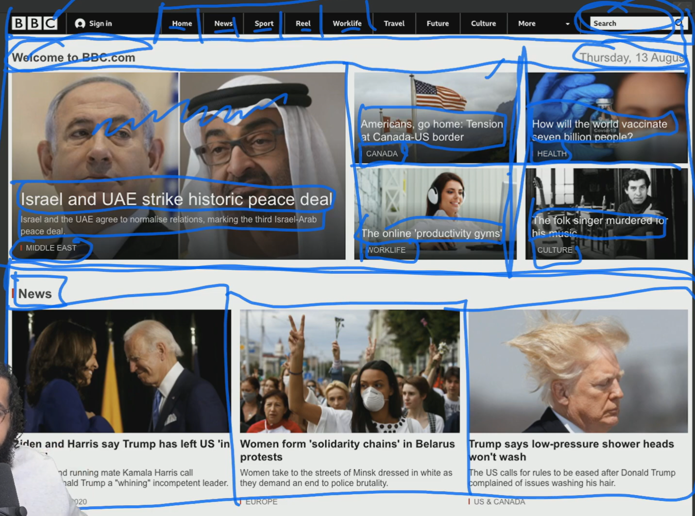

# Lesson 06: Review HTML & CSS 🚀

## **What You'll Learn**
- Review - HTML Fundamentals
- Review - CSS Fundamentals
- Review - Box Model
- Review - Float 😱
- Review - Three Simple Layouts
- Learn - Responsive Basics
- Homework: Simple Responsive Site

---

## 📚 **Review - HTML Fundamentals**
- The Golden Rule - Separation of Concerns
- HTML = Content, CSS = Style, JS = Behavior
- HTML Syntax
```html
<p class="intro">Hello, World!</p>
```
- <p> is opening tag, </p> is closing tag, class is an attribute, "intro" is its value.
- Time for some tags
- Headings: h1, h2, h3, h4, h5, h6 (h1 being most important)
- p: paragraph, span: short inline text, pre: preformatted text
- Containing tags: div, section, article, aside, header, footer, nav
- Markup BBC News homepage


## 🎨 **Review - CSS Fundamentals**
- Where does CSS go?
- Inline, Internal, External (Separate File)
- Inline Style give 1000 points specificity, and that's a lot if we want to override it.
- Use a separate file for CSS in head section of HTML.
```html
<link rel="stylesheet" href="styles.css">
```
- CSS Syntax
```css
p {
  color: red;
  font-weight: bold;
}
```
- 'red' is a value, 'color' is a property, 'color: red;' is a declaration.
- p {} is a rule, and everything inside {} is a declaration block.
- Why we want to link to a separate file?
- Separation of Concerns, Reusability, Maintainability

- Simple Styles:

- Color: Words (yellow), Hex (#ff0), RGBA (rgb(255, 255, 0, 1)), HSLA (hsl(60, 100%, 50%, 1))

- Fonts: font-family (Arial, sans-serif), font-size (16px), font-weight (bold)
- Use MDN for CSS Reference (https://developer.mozilla.org/en-US/docs/Web/CSS)
- Also, read https://learn.shayhowe.com/advanced-html-css/ for more details.
